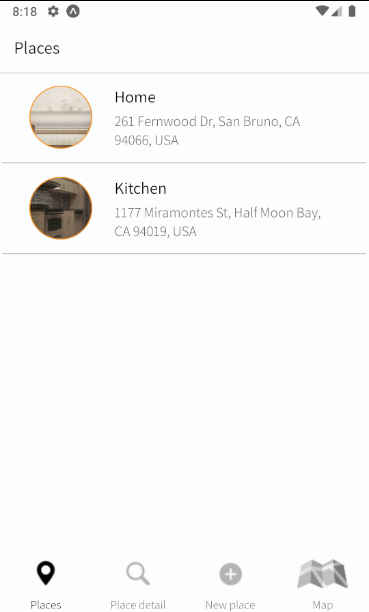

# Locations

Your pictures, exactly as you took it, only for your eyes to see.

Locations is a privacy-focused camera app.
Whenever you take a picture with Locations, the image is enriched with location and time metadata and is then safely encrypted on you own device.

Locations empowers you to remember your most precious moments while being sensitive about who gets to see them.

## Demo

## Installation
Clone the repository 

## Project debrief
App that uses the native mobile Camera, Maps, SQLite database and location modules.

This app allows you to:
- take a picture using your device's native camera.
- edit the taken picture before it is saved.
- select a location on the map (provided by the Google Maps API)
- bind a location to a taken picture.
- save a location into a SQLite database stored on the device's memory.
- preview the list of previously saved locations.
- access previously saved locations details info.
